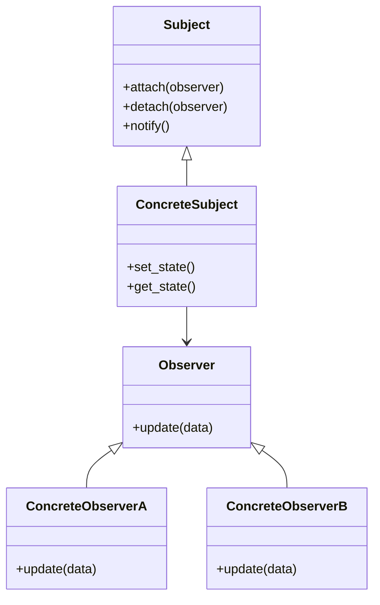

**類型**：Behavioral Pattern
**別名**：Publish–Subscribe（發布 / 訂閱模式）、Listener Pattern（監聽者模式）

## **💡 1. 定義（Definition）**

> **Observer Pattern** 讓一個物件（Subject）可以自動通知多個依賴它的物件（Observers），
> 當它的狀態改變時，所有觀察者都會收到更新。

📘 換句話說：

> 「一個人更新 → 一群人自動收到通知」
> 類似 YouTube 訂閱、事件監聽、社群動態推播。

---
## **🎯 2. 問題背景（Problem Statement）**

假設你有一個「股票價格更新系統」：

- 當價格改變時，系統需要通知：    
    - EmailService
    - SMSService
    - LINE Bot
    - Logging Service

如果你寫成：
```python
price.update()
email.send()
sms.send()
line.send()
logger.log()
```

❌ 問題：
- 每增加一個通知方式，你就要改 price.update() 這段程式碼
- 違反 **開放封閉原則（OCP）**
- 「通知邏輯」和「價格邏輯」耦合在一起
- 測試與維護變困難

你希望：
- 新增 / 移除監聽者不影響 Subject
- Subject 不知道每個 Observer 的細節
- 讓通知流程自動觸發，而非手動呼叫

✅ 解法：
> 讓 Observers 自己「訂閱」 Subject。
> Subject 的狀態改變後，會主動通知所有 Observers。

---
## **⚙️ 3. 解決方案（Solution）**

> 將「狀態持有者」與「需要知道狀態的物件」分離。
> Subject 負責管理 Observer 名單，並在變更時呼叫它們的 update()。

這樣：
- Subject 不需要知道 observers 是誰、要做什麼
- Observers 可以被動更新
- 可自由增刪監聽者
- 系統更鬆耦合

---

## **🧱 4. 結構與角色（Structure & Participants）**

|**角色**|**職責**|
|---|---|
|**Subject**|保存狀態、管理 observer 名單|
|**Observer**|定義接收更新的方法|
|**ConcreteSubject**|實作 Subject，當狀態改變時通知 observers|
|**ConcreteObserver**|實作 observer 處理邏輯|
|**Client**|訂閱 / 取消訂閱、觸發流程|



## **🧩 5. 程式碼範例（Python）**

### **🧱 範例：股票價格通知（Stock Price Observer）**
```python
# === Observer 介面 ===
class Observer:
    def update(self, price):
        raise NotImplementedError


# === Subject ===
class StockPrice:
    def __init__(self):
        self._observers = []
        self._price = None

    def attach(self, observer: Observer):
        self._observers.append(observer)

    def detach(self, observer: Observer):
        self._observers.remove(observer)

    def set_price(self, price):
        print(f"📈 Stock price updated: {price}")
        self._price = price
        self.notify()

    def notify(self):
        for observer in self._observers:
            observer.update(self._price)


# === Observers ===
class EmailNotifier(Observer):
    def update(self, price):
        print(f"📧 Email sent → price: {price}")

class SMSNotifier(Observer):
    def update(self, price):
        print(f"📩 SMS sent → price: {price}")

class LineNotifier(Observer):
    def update(self, price):
        print(f"💬 LINE message sent → price: {price}")


# === Client Code ===
price = StockPrice()

price.attach(EmailNotifier())
price.attach(SMSNotifier())
price.attach(LineNotifier())

price.set_price(150)
price.set_price(180)
```

輸出：
```
📈 Stock price updated: 150
📧 Email sent → price: 150
📩 SMS sent → price: 150
💬 LINE message sent → price: 150

📈 Stock price updated: 180
📧 Email sent → price: 180
📩 SMS sent → price: 180
💬 LINE message sent → price: 180
```

💡 Subject 完全不知道 observers 的細節
（是 Email? 是 SMS? 是 LINE? 完全不重要）

## **🧠 6. 實際應用場景（Real-world Use Cases）**

|**場景**|**實例**|
|---|---|
|🔔 Event System|DOM addEventListener、Node.js EventEmitter|
|📨 訊息通知系統|Email / SMS / Webhook / LINE Bot 多管道通知|
|🧠 AI Pipeline|preprocessor → inference → postprocessor 事件鏈|
|🔄 資料同步|Redis Pub/Sub、Kafka、RabbitMQ（本質即 Observer）|
|🖥 GUI Frameworks|按鈕點擊、狀態改變事件（Qt, Tkinter, SwiftUI）|
|📊 監控與告警系統|CPU 波動觸發多個告警（Slack、PagerDuty、Webhook）|
|🏦 金流 / 訂單流程|訂單狀態更新後 → 觸發一連串通知與事件|

## **⚖️ 7. 優點與缺點（Pros & Cons）**

| **優點**                       | **缺點**                |
| ---------------------------- | --------------------- |
| ✅ 完全符合 OCP，新增 observer 不改主程式 | ❌ 調試更困難（呼叫鏈較隱晦）       |
| ✅ 多對多通知，鬆耦合                  | ❌ 可能導致「通知風暴」          |
| ✅ 高擴展性、彈性                    | ❌ 順序性不可控（對某些應用是缺點）    |
| ✅ 非同步系統架構核心                  | ❌ 必須管理訂閱/退訂，否則容易記憶體洩漏 |

## **🔍 8. 與其他模式比較（Comparison）**

| **模式**                              | **差異**                            |
| ----------------------------------- | --------------------------------- |
| **Observer**                        | 一對多通知，事件驅動                        |
| **Mediator**                        | 集中化協調，避免物件互相引用                    |
| **Publisher / Subscriber（Pub/Sub）** | Observer 的分散式版本，透過 Message Broker |
| **Chain of Responsibility**         | 順序處理請求，一次一個 handler               |

💡 記法：

- Observer：**通知所有訂閱者**
- Pub/Sub：**透過 Broker 消息分發**
- CoR：**一個個處理**
- Mediator：**大家都找仲介（中心）**

## **🧭 9. 實務設計指引（Design Tips）**

- ✅ 當你有「一對多」的狀態同步需求 → 用 Observer
- ✅ 適合 event-driven 系統（後端非常常見）
- 💬 Node.js、前端框架、MQ 都內建 Observer 概念
- 🚫 若通知量大，應改用 Kafka / RabbitMQ（Pub/Sub）替代
- 🚫 不要讓 Observer 裡面做太重的事，否則會拖慢整個 Subject

## **🧮 10. 面試考點（Interview Insights）**

|**問題**|**回答重點**|
|---|---|
|Observer 解決什麼問題？|一對多通知、自動同步、鬆耦合|
|Observer vs Pub/Sub？|Pub/Sub 透過 message broker，兩者不同層|
|Observer 適用情境？|通知系統、監控、GUI 事件、狀態同步|
|Python 如何實現？|訂閱名單 + update() 呼叫|
|缺點？|調試困難、訂閱管理麻煩、可能有通知風暴|

## **✅ 11. 一句話總結（One-liner Summary）**

> **Observer Pattern 是所有事件系統、通知、狀態同步的基礎，**
> **一個動作觸發多個反應，就是觀察者模式的精髓。**

---

## **📚 12. 延伸閱讀（Further Reading）**

- 📘 _Design Patterns: Elements of Reusable Object-Oriented Software_
- 🧩 Refactoring.Guru – [Observer Pattern](https://refactoring.guru/design-patterns/observer)
- 🧱 Example: Node.js EventEmitter, Redis Pub/Sub, Webhooks
---