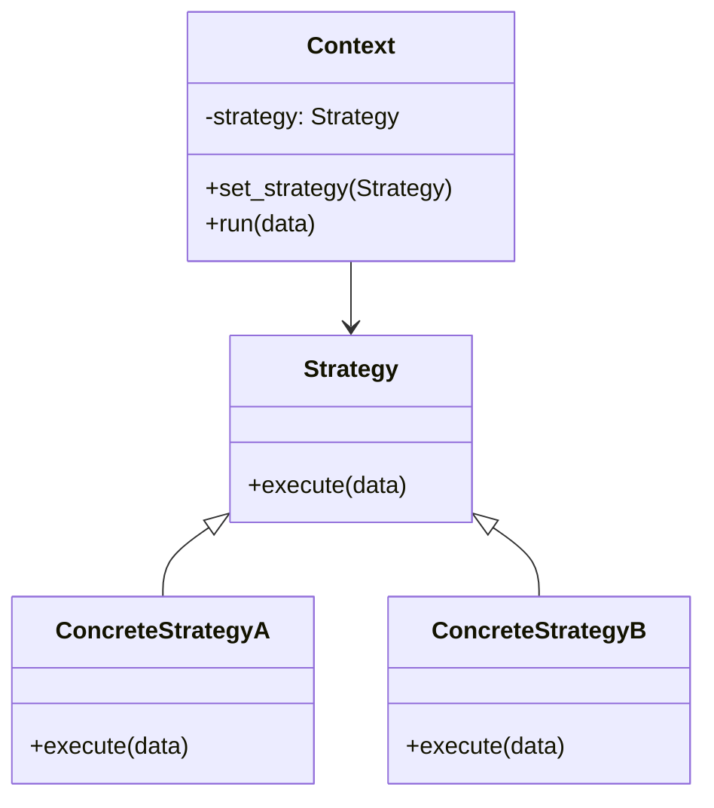

**類型**：Behavioral Pattern
**別名**：Policy Pattern（政策模式）

參考資料：
https://www.youtube.com/watch?v=eofyXRNCiVE

---
## **💡 1. 定義（Definition）**

> **Strategy Pattern** 將行為（演算法）抽象化，
> 並讓不同策略（Strategy）可以在執行時被替換。

📘 換句話說：
> 「把演算法獨立成類別，
> 讓你可以 _動態選擇_、_替換_、_新增_ 行為，而不用改原本的程式碼。」

策略模式的本質是：

➡ **用「組合」取代「一堆 if-else」**
➡ **變動的是策略，不變的是流程**

---

## **🎯 2. 問題背景（Problem Statement）**

想像你有一個「運費計算系統」：

```python
if method == "black_cat":
    fee = weight * 10
elif method == "post_office":
    fee = weight * 8
elif method == "fedex":
    fee = weight * 15
```

❌ 問題：
- if-else 爆炸    
- 新增策略要一直改這段程式 → **違反 OCP（開放封閉原則）**
- 客戶端與策略耦合太高
- 測試困難  

你希望：
- 不改主流程即可新增新的運算策略
- 能動態切換策略
- 減少 if-else，讓系統更乾淨

✅ 解法：
> 把每種策略（演算法）獨立成類別，
> 由 Context 根據传入的 Strategy 來決定行為。

---
## **⚙️ 3. 解決方案（Solution）**

> Strategy Pattern 讓你把「演算法（Strategy）」抽象成介面，
> 不同實作（Concrete Strategy）負責不同邏輯，
> 而 Context 只負責「使用策略」，不關心細節。

此模式讓演算法：

- 可以替換    
- 可以動態注入
- 可以擴展
- 互相獨立，不互相污染

---

## **🧱 4. 結構與角色（Structure & Participants）**
| **角色**               | **職責**                |
| -------------------- | --------------------- |
| **Strategy**         | 演算法介面                 |
| **ConcreteStrategy** | 演算法實作                 |
| **Context**          | 使用 Strategy 執行行為，不管細節 |
| **Client**           | 選擇要使用哪一種策略            |



## **🧩 5. 程式碼範例（Python）**

### **🧱 範例：運費計算（Shipping Fee Strategies）**

```python
# === Strategy 介面 ===
class ShippingStrategy:
    def calculate(self, weight):
        raise NotImplementedError


# === 各種策略 ===
class BlackCatStrategy(ShippingStrategy):
    def calculate(self, weight):
        return weight * 10


class PostOfficeStrategy(ShippingStrategy):
    def calculate(self, weight):
        return weight * 8


class FedexStrategy(ShippingStrategy):
    def calculate(self, weight):
        return weight * 15


# === Context ===
class ShippingCalculator:
    def __init__(self, strategy: ShippingStrategy):
        self.strategy = strategy

    def set_strategy(self, strategy: ShippingStrategy):
        self.strategy = strategy

    def calculate(self, weight):
        return self.strategy.calculate(weight)


# === Client Code ===
calc = ShippingCalculator(BlackCatStrategy())
print(calc.calculate(5))   # Black Cat

calc.set_strategy(PostOfficeStrategy())
print(calc.calculate(5))   # Post Office

calc.set_strategy(FedexStrategy())
print(calc.calculate(5))   # Fedex
```

輸出：
```python
50
40
75
```

💡 Context 不需要知道如何計算運費，
只要知道 strategy 有 calculate() 方法即可。

---

## **🧠 6. 實際應用場景（Real-world Use Cases）**

| **場景**         | **實例**                                   |
| -------------- | ---------------------------------------- |
| 💳 金流 / 訂單流程   | 多種付款方式（Stripe / PayPal / Line Pay）       |
| 🧠 AI Pipeline | 可替換不同 tokenizer, embedding, reranker     |
| 📦 運費系統        | 黑貓、郵局、Fedex、不同行業計算公式                     |
| 🎮 遊戲 AI       | 不同 NPC 行為策略（攻擊、防禦、逃跑、巡邏）                 |
| 📊 演算法切換       | 依據輸入資料大小選擇 quicksort 或 mergesort         |
| ✏️ 驗證規則        | 不同 validation policy                     |
| 📈 排程演算法       | FIFO / Round-robin / Priority Scheduling |

## **⚖️ 7. 優點與缺點（Pros & Cons）**

| **優點**              | **缺點**                |
| ------------------- | --------------------- |
| ✅ 消滅 if-else        | ❌ 類別數量變多              |
| ✅ 支援動態切換            | ❌ Context 需要了解有哪些策略可用 |
| ✅ 新策略不需改舊程式（符合 OCP） | ❌ 介面需要穩定設計            |
| ✅ 適合高延展性系統          | ❌ 過度使用會使設計複雜          |

## **🔍 8. 與其他模式比較（Comparison）**

| **模式**              | **差異**                          |
| ------------------- | ------------------------------- |
| **Strategy**        | 抽象多種演算法，動態替換                    |
| **State**           | 狀態轉換 + 行為改變（策略會變，Context 狀態也會改） |
| **Template Method** | 父類別定義流程，子類別定義步驟（繼承，非組合）         |
| **Command**         | 把「動作」封裝，重點是對請求封裝，而不是演算法         |
💡 要點：
- Strategy = 換演算法    
- State = 換狀態
- Template = 換流程步驟
- Command = 換請求

## **🧭 9. 實務設計指引（Design Tips）**

- ✅ 當你看到「一堆 if-else 決定用哪個邏輯」 → 用 Strategy
- ✅ 適合「邏輯常變、規則常變」的場景
- ✅ 配合 DI（依賴注入）效果更好
- 🚫 不要為了用而用，小心類別爆炸
- 💬 將策略獨立成 service module，有利於測試與維護

---

## **🧮 10. 面試考點（Interview Insights）**

| **問題**                | **回答重點**                           |
| --------------------- | ---------------------------------- |
| 為什麼需要 Strategy？       | 取代 if-else，保持程式可擴展（OCP）            |
| 使用 Strategy 的情境？      | 多種演算法、計價方式、規則引擎                    |
| Context 做什麼？          | 注入策略並呼叫它，不管細節                      |
| Strategy 跟 State 差在哪？ | State 會影響 Context 狀態變化，Strategy 不會 |

## **✅ 11. 一句話總結（One-liner Summary）**

> 「Strategy Pattern 讓你用“替換演算法”取代“if-else 地獄”，
> 讓系統更乾淨、更柔性、更容易擴展。」


## **📚 12. 延伸閱讀（Further Reading）**

- 📘 _Design Patterns: Elements of Reusable Object-Oriented Software_
- 🧩 Refactoring.Guru – [Strategy Pattern](https://refactoring.guru/design-patterns/strategy)
- 🧱 Example: Python sorting strategy, AI inference pipeline strategies


---

# **什麼是依賴注入（Dependency Injection, DI）？**

定義：

> **不要讓類別“自己 new 出它的依賴”，**
> **而是從外部“注入（Inject）”給它。**

也就是：

- 不要內部 hardcode 依賴    
- 改由外部傳入
- 讓依賴可以被替換、抽換、stub、mock

例：
```python
class OrderService:
    def __init__(self, payment):
        self.payment = payment
```

你決定要用哪個 payment：
```python
order = OrderService(StripePayment())
```

要換成 PayPal：
```python
order = OrderService(PayPalPayment())
```
👉 **OrderService 不需要修改一行程式碼！**

# **Strategy Pattern + DI 是為什麼天作之合？**

Strategy Pattern 本質就是：

> 同一個流程可以替換不同策略（演算法）。

例如：
```python
calc = ShippingCalculator(BlackCatStrategy())
calc = ShippingCalculator(PostOfficeStrategy())
```

但這只有在 **策略透過 DI 注入** 才能做到。
如果你這樣寫：

```python
class ShippingCalculator:
    def __init__(self):
        self.strategy = BlackCatStrategy()
```

缺點很明顯：

❌ 無法切換策略
❌ 不能做多型
❌ 不能 unit test
❌ 不能做 A/B testing
❌ 無法支援 plug-in 設計

而使用 DI：
```python
calc = ShippingCalculator(strategy=BlackCatStrategy())
```

換策略只要換參數，不需改任何 code：
```python
calc.set_strategy(PostOfficeStrategy())
```

> **DI 讓 Strategy Pattern 變成可替換、可配置、可擴展的真正“策略”。**

# **範例：Strategy + DI**

定義策略

```python
class PaymentStrategy:
    def pay(self, amount): ...
```

兩個策略
```python
class StripePayment(PaymentStrategy):
    def pay(self, amount):
        print("Using Stripe")


class PayPalPayment(PaymentStrategy):
    def pay(self, amount):
        print("Using PayPal")
```

Service 透過 DI 注入策略
```python
class CheckoutService:
    def __init__(self, payment: PaymentStrategy):
        self.payment = payment

    def checkout(self, amount):
        return self.payment.pay(amount)
```

Client 選策略（DI）
```python
service = CheckoutService(PayPalPayment())
service.checkout(100)
```

要換策略？
```python
service = CheckoutService(StripePayment())
service.checkout(100)
```

完全不需要修改 CheckoutService 的程式碼。


# **DI 的好處**
| **好處**                         | **說明**                    |
| ------------------------------ | ------------------------- |
| **可替換性**                       | 想換成另一個策略 / 另一個 DB，只要換注入參數 |
| **可測試性**                       | 可以注入 Mock，以做 unit test    |
| **可擴展性**                       | 加新策略不改舊 code              |
| **降低耦合**                       | 不會語法上硬綁某個實作               |
| **配合 Strategy / Command 效果極好** | 彈性提升                      |