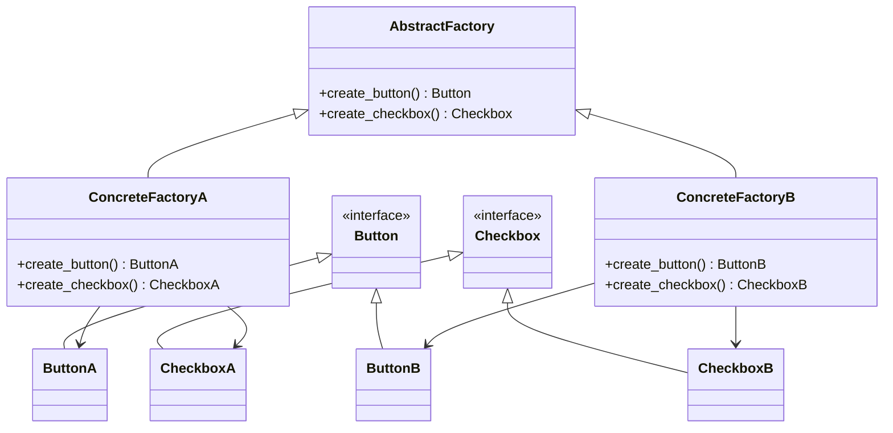

**類型**：Creational Pattern
**別名**：Kit / Factory of Factories（工廠的工廠）

## **💡 1. 定義（Definition）**

> **Abstract Factory Pattern** 提供一個介面，
> 用來建立「一組相關或相依的物件」，而不需要指定它們的具體類別。

換句話說：

> ✅ 它不是建立單一物件（像 Factory Method），
> 而是**建立一整組「互相協調」的產品族（Product Family）**。

---
## **🎯 2. 問題背景（Problem Statement）**

假設你要設計一個跨平台 UI 系統：

```
WindowsButton / WindowsCheckbox  
MacButton / MacCheckbox
```

若直接用 Factory Method，你得各自建立兩個 Factory：

```python
WindowsButtonFactory, MacButtonFactory
```

但如果 UI 不只一種元件，而是「一整個風格家族」，
（例如 Material、iOS、Dark Mode、Light Mode）
那就會爆炸式增加 factory 數量。

👉 解法：
建立一個 **「抽象工廠」**，
讓每個工廠能一次產出多個相關產品（Button、Checkbox、Input）。

---

## **⚙️ 3. 解決方案（Solution）**

> 建立一個「抽象工廠介面」，
> 裡面包含多個建立方法（每個方法對應一種產品）。
>   
> 具體工廠（Concrete Factory）負責實作這些方法，
> 產生同一風格的元件。

## **🧱 4. 結構與角色（Structure & Participants）**

|**角色**|**職責**|
|---|---|
|**AbstractFactory**|定義建立多種產品的介面|
|**ConcreteFactory**|實作具體的產品族建立|
|**AbstractProduct**|定義產品介面|
|**ConcreteProduct**|實作具體產品|
|**Client**|使用抽象工廠建立物件，而不依賴具體類別|




## **🧩 5. 程式碼範例（Python）**

```python
from abc import ABC, abstractmethod

# === Abstract Products ===
class Button(ABC):
    @abstractmethod
    def render(self):
        pass

class Checkbox(ABC):
    @abstractmethod
    def render(self):
        pass


# === Concrete Products ===
class MacButton(Button):
    def render(self):
        return "Render a Mac-style button"

class MacCheckbox(Checkbox):
    def render(self):
        return "Render a Mac-style checkbox"

class WindowsButton(Button):
    def render(self):
        return "Render a Windows-style button"

class WindowsCheckbox(Checkbox):
    def render(self):
        return "Render a Windows-style checkbox"


# === Abstract Factory ===
class GUIFactory(ABC):
    @abstractmethod
    def create_button(self) -> Button:
        pass

    @abstractmethod
    def create_checkbox(self) -> Checkbox:
        pass


# === Concrete Factories ===
class MacFactory(GUIFactory):
    def create_button(self):
        return MacButton()

    def create_checkbox(self):
        return MacCheckbox()

class WindowsFactory(GUIFactory):
    def create_button(self):
        return WindowsButton()

    def create_checkbox(self):
        return WindowsCheckbox()


# === Client ===
def client_code(factory: GUIFactory):
    button = factory.create_button()
    checkbox = factory.create_checkbox()

    print(button.render())
    print(checkbox.render())

# === 使用 ===
client_code(MacFactory())
client_code(WindowsFactory())
```


🧠 說明：
- GUIFactory 是抽象工廠
- MacFactory / WindowsFactory 為具體工廠
- Client 完全不知道產品的具體實作，照樣能運作

## **🧠 6. 實際應用場景（Real-world Use Cases）**

|**場景**|**實例**|
|---|---|
|🖥️ 跨平台 UI 系統|Windows / Mac / Linux GUI 套件|
|☁️ 雲端 SDK 工廠|AWSFactory / GCPFactory 同時建立多個服務物件|
|🧩 Plugin 系統|建立一組 plugin instance（handler, validator, executor）|
|🧱 Database 驅動組合|同時建立 QueryBuilder、Connection、TransactionManager|
|🧠 AI 模型工廠|建立完整 pipeline（Tokenizer, Model, Embedding）|

## **⚖️ 7. 優點與缺點（Pros & Cons）**

| **優點**          | **缺點**       |
| --------------- | ------------ |
| ✅ 封裝產品家族建立邏輯    | ❌ 類別結構複雜、開銷大 |
| ✅ 確保產品間相容性      | ❌ 不易擴展新的產品種類 |
| ✅ 實現高一致性（同風格元件） | ❌ 多層抽象不易維護   |

## **🔍 8. 與其他模式比較（Comparison）**

|**模式**|**差異**|
|---|---|
|**Factory Method**|建立單一產品，讓子類別決定具體類別|
|**Abstract Factory**|建立**一整組**產品族（產品之間有關聯）|
|**Builder Pattern**|注重「建構過程」，不是「選擇哪種產品」|
|**Prototype Pattern**|從現有物件複製，而不是建立新產品|

## **🧭 9. 實務設計指引（Design Tips）**

- ✅ 適合大型平台、SDK、plugin 架構
- 🚫 不適合簡單 CRUD 型服務
- 💬 當「新增平台」比「新增產品」更常見時，Abstract Factory 很划算
- 🧱 若只需建立單一產品，用 Factory Method 即可（不要 over-engineer）


## **🧮 10. 面試考點（Interview Insights）**

|**問題**|**關鍵回答**|
|---|---|
|Abstract Factory 解決什麼？|建立一組相容產品的介面，避免耦合。|
|跟 Factory Method 有什麼不同？|Factory Method → 一個產品；Abstract Factory → 多個相關產品。|
|實際例子？|AWS / GCP SDK、跨平台 UI Toolkit、ORM Adapter。|

## **✅ 11. 一句話總結（One-liner Summary）**

> 「Abstract Factory 是 Factory 的升級版，
> 能一次建立多個互相協調的物件族群，
> 用於複雜系統或跨平台 SDK 架構。」


## **📚 12. 延伸閱讀（Further Reading）**

- 📘 _Design Patterns: Elements of Reusable Object-Oriented Software_
- 🧩 Refactoring.Guru – [Abstract Factory Pattern](https://refactoring.guru/design-patterns/abstract-factory)
- 🧱 Example: PyQt GUI Factory, AWS SDK client builder


# **Factory Method vs Abstract Factory**

| **特性** | **Factory Method**      | **Abstract Factory** |
| ------ | ----------------------- | -------------------- |
| 建立什麼？  | 單一物件                    | 一整組相容物件              |
| 適用場景   | 想根據條件決定要建立哪一種產品         | 想要同時建立多個互相搭配的產品      |
| 舉例     | 建立單一飲料                  | 建立整份早餐套餐             |
| 延伸關係   | 是 Abstract Factory 的子概念 | 封裝多個 Factory Method  |

### **🍳 Factory Method：**

就像你點餐時說：「我要一杯飲料」，
服務員會根據你選擇的類型「咖啡」或「紅茶」來決定要倒哪種。

```python
# Factory Method
class DrinkFactory:
    def create_drink(self, drink_type):
        if drink_type == "coffee":
            return Coffee()
        elif drink_type == "tea":
            return Tea()

class Coffee:
    def serve(self):
        print("☕ Serving a hot coffee")

class Tea:
    def serve(self):
        print("🍵 Serving a green tea")

# 用法
factory = DrinkFactory()
drink = factory.create_drink("coffee")
drink.serve()
```

💡 **重點：**
Factory Method 只處理「一種產品類別」（飲料），
只是可以動態決定要哪一個版本。

### **🧁 Abstract Factory：**

假設你今天開的是「早餐店」，
一份套餐包括：
- 一杯飲料（Drink）
- 一份主餐（MainDish）
    而且你有兩種風格：
    🇹🇼 台式早餐、🇺🇸 美式早餐。

你就可以用「抽象工廠」一次產出整組相容的產品。

```python
# Abstract Factory
class BreakfastFactory:
    def create_drink(self):
        pass
    def create_main(self):
        pass

class TaiwaneseBreakfastFactory(BreakfastFactory):
    def create_drink(self):
        return SoyMilk()
    def create_main(self):
        return EggPancake()

class AmericanBreakfastFactory(BreakfastFactory):
    def create_drink(self):
        return Coffee()
    def create_main(self):
        return Sandwich()

# 各種產品
class SoyMilk: 
    def serve(self): print("🥛 Serving soymilk")

class EggPancake: 
    def serve(self): print("🥞 Serving egg pancake")

class Coffee: 
    def serve(self): print("☕ Serving coffee")

class Sandwich: 
    def serve(self): print("🥪 Serving sandwich")

# 客戶端
def serve_breakfast(factory: BreakfastFactory):
    drink = factory.create_drink()
    main = factory.create_main()
    drink.serve()
    main.serve()

serve_breakfast(TaiwaneseBreakfastFactory())
serve_breakfast(AmericanBreakfastFactory())
```


✅ **一句話記法：**

> Factory 是「我今天要哪一種產品？」
> Abstract Factory 是「我今天要哪一套系列產品？」

