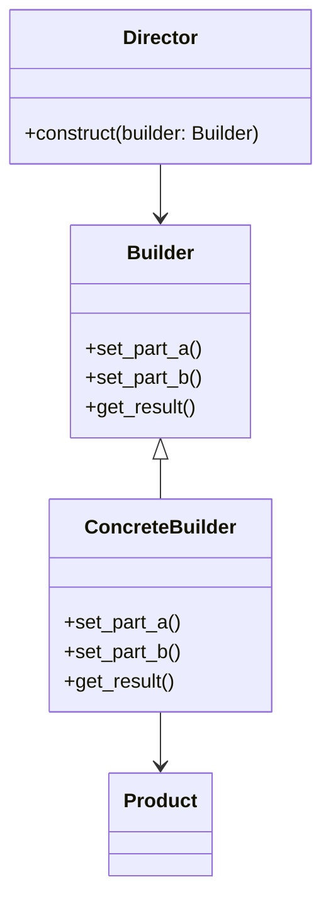

**類型**：Creational Pattern
**別名**：建造者模式（Object Construction Pattern）

## **💡 1. 定義（Definition）**

> **Builder Pattern** 將「複雜物件的建構過程」與「最終表示（representation）」分離，
> 讓相同的建構過程可以產生不同形式的物件。

📘 簡單說：

> 「當一個物件有很多欄位、初始化很複雜時，
> 不要一次塞進 __init__，改用 Builder 分步構建。」

---

## **🎯 2. 問題背景（Problem Statement）**

假設你要建立一個 UserProfile 物件，
有很多可選參數：nickname, age, email, avatar, bio, settings…

一般作法👇
```python
user = UserProfile("Frankie", 27, None, None, "Backend Dev", None)
```

👉 問題：

- 可選欄位太多，難讀又容易傳錯。
- 初始化參數順序太長。
- 不同版本（例如簡版 / 詳版 / 匿名版）重複代碼。


## **⚙️ 3. 解決方案（Solution）**

> 使用 **Builder** 分步建立物件，每一步只負責設定一部分屬性。
> 最後由 Builder 的 build() 方法產生完整物件。


## **🧱 4. 結構與角色（Structure & Participants）**
|**角色**|**職責**|
|---|---|
|**Builder (建造者介面)**|定義建造各部分的方法|
|**ConcreteBuilder**|實際實作建造邏輯|
|**Director (導演類別)**|控制建構流程（可選）|
|**Product**|最終生成的複雜物件|



## **🧩 5. 程式碼範例（Python）**

### **🧱 Builder Pattern Example**

```python
# === Product ===
class UserProfile:
    def __init__(self):
        self.nickname = None
        self.age = None
        self.email = None
        self.avatar = None
        self.bio = None
    
    def __repr__(self):
        return f"UserProfile({self.nickname}, {self.age}, {self.email}, {self.avatar}, {self.bio})"


# === Builder ===
class UserProfileBuilder:
    def __init__(self):
        self.user = UserProfile()

    def set_nickname(self, nickname):
        self.user.nickname = nickname
        return self

    def set_age(self, age):
        self.user.age = age
        return self

    def set_email(self, email):
        self.user.email = email
        return self

    def set_avatar(self, avatar):
        self.user.avatar = avatar
        return self

    def set_bio(self, bio):
        self.user.bio = bio
        return self

    def build(self):
        return self.user


# === 使用 ===
user = (
    UserProfileBuilder()
    .set_nickname("Frankie")
    .set_age(27)
    .set_bio("Backend Engineer & Music Lover")
    .build()
)

print(user)
```

輸出：
```
UserProfile(Frankie, 27, None, None, Backend Engineer & Music Lover)
```

🧠 說明：
- .set_xxx() 回傳自己（支援 chaining）
- .build() 統一生成物件

---
### **🧰 加入 Director（可選）**

當建構邏輯固定時可用 Director 管控建構順序：

```python
class UserDirector:
    def __init__(self, builder):
        self.builder = builder

    def construct_simple_user(self):
        return self.builder.set_nickname("Guest").set_bio("Anonymous user").build()
```

---

## **🧠 6. 實際應用場景（Real-world Use Cases）**

| **場景**                   | **實例**                                     |
| ------------------------ | ------------------------------------------ |
| 🏗️ **物件初始化很複雜時**        | 設定檔、HTTP 請求、AI pipeline                    |
| 🧩 **分步組合設定**            | 建立 Docker Compose config、API query builder |
| 🧾 **不同版本物件**            | 簡易用戶 vs 進階用戶、不同環境設定                        |
| ☁️ **SDK / API 建立請求**    | OpenAI, AWS SDK, FastAPI request builder   |

---

## **⚖️ 7. 優點與缺點（Pros & Cons）**

| **優點**             | **缺點**                        |
| ------------------ | ----------------------------- |
| ✅ 可讀性高、支援 chaining | ❌ 類別結構變多                      |
| ✅ 支援複雜組裝流程         | ❌ 建構過程不透明（不適合簡單物件）            |
| ✅ 易於擴展、重複利用建構邏輯    | ❌ 若 Product 結構太簡單會顯得 overkill |

## **🔍 8. 與其他模式比較（Comparison）**

|**模式**|**差異**|
|---|---|
|**Factory Method**|關注「建立哪一種物件」|
|**Builder**|關注「如何一步步建立複雜物件」|
|**Prototype**|從現有物件複製，不是重建|
|**Abstract Factory**|一次建立一組產品，非一步步構建|

## **🧭 9. 實務設計指引（Design Tips）**

- ✅ 適合需要「多步設定」的物件（尤其 config-heavy 系統）
- ✅ 可與 **Fluent Interface** 搭配（連鎖呼叫 .set_xxx()）
- 🚫 若初始化只有兩三個欄位，不必使用
- 💬 可與 Factory Pattern 結合：Factory 建立 Builder，再由 Builder 組裝物件


## **🧮 10. 面試考點（Interview Insights）**

| **問題**               | **你應該怎麼回答**                                     |
| -------------------- | ----------------------------------------------- |
| 什麼是 Builder Pattern？ | 將物件的建構過程與最終表示分離。                                |
| 為什麼不用多個建構子？          | Builder 更具可讀性、支援鏈式設定。                           |
| 實際例子？                | Query builder, Config builder, Request builder。 |
| Python 怎麼實現？         | 使用 chaining methods + 最後 build()。               |

## **✅ 11. 一句話總結（One-liner Summary）**

> 「Builder Pattern 讓你一步步建立複雜物件，
> 既清晰又靈活，特別適合 config-heavy 或多階段初始化場景。」


## **📚 12. 延伸閱讀（Further Reading）**

- 📘 _Design Patterns: Elements of Reusable Object-Oriented Software_
- 🧩 Refactoring.Guru – [Builder Pattern](https://refactoring.guru/design-patterns/builder)
- 🧱 Example: SQLAlchemy Query Builder / OpenAI API Request Builder