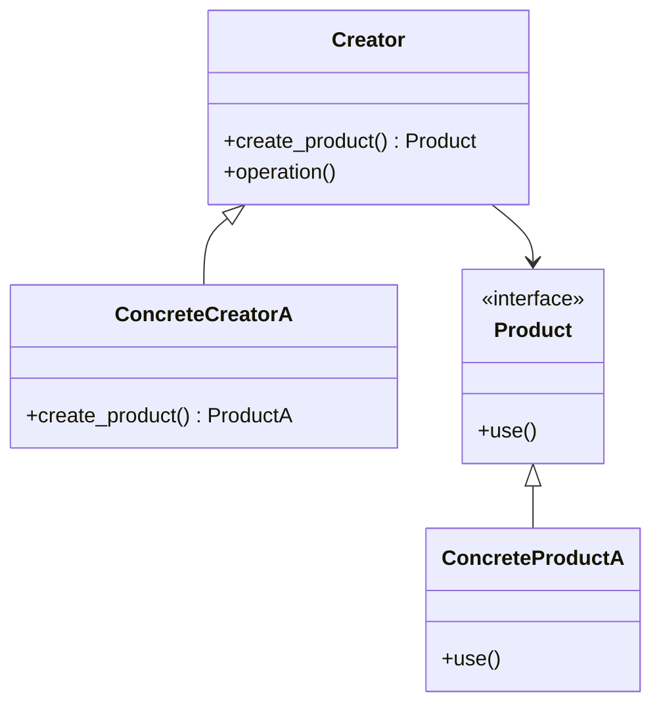

**類型**：Creational Pattern
**別名**：Virtual Constructor（虛擬建構子）

## **💡 1. 定義（Definition）**

> **Factory Method Pattern** 定義一個建立物件的介面，
> 但讓子類別決定實際要建立哪一個類別。
>   
> ✅ 換句話說：**「把 new 的決定權延後到子類別。」**

它解決的問題是：

> 當一個類別無法預先知道要建立哪一種具體物件時，
> 將物件建立的責任交給子類別或外部工廠。


## **🎯 2. 問題背景（Problem Statement）**

假設你要設計一個文件轉換系統：
```
PDFConverter
WordConverter
ExcelConverter
```

如果你在主程式裡直接：
```python
if file_type == "pdf":
    return PDFConverter()
elif file_type == "word":
    return WordConverter()
```

🔻 問題是：
- 每增加一個新格式都得改程式碼（違反 **開放封閉原則 OCP**）。
- 主程式與具體類別強耦合。

👉 解法：
將物件建立的邏輯封裝在「工廠方法」中。


## **⚙️ 3. 解決方案（Solution）**

> 定義一個抽象的「Creator」類別，
> 其中包含一個抽象方法 create_product()，
> 子類別負責實際建立不同的產品（Product）。


## **🧱 4. 結構與角色（Structure & Participants）**

|**角色**|**職責**|
|---|---|
|**Product (產品介面)**|定義所有產品的共同介面|
|**ConcreteProduct (具體產品)**|各種具體實作類別|
|**Creator (工廠介面)**|定義抽象工廠方法 create_product()|
|**ConcreteCreator (具體工廠)**|實作工廠方法，建立對應產品|



## **🧩 5. 程式碼範例（Python）**

```python
from abc import ABC, abstractmethod

# === Product ===
class Document(ABC):
    @abstractmethod
    def open(self):
        pass

class PDFDocument(Document):
    def open(self):
        return "Opening PDF file..."

class WordDocument(Document):
    def open(self):
        return "Opening Word file..."


# === Creator ===
class DocumentCreator(ABC):
    @abstractmethod
    def create_document(self) -> Document:
        pass

    def open_file(self):
        doc = self.create_document()
        return doc.open()

class PDFCreator(DocumentCreator):
    def create_document(self):
        return PDFDocument()

class WordCreator(DocumentCreator):
    def create_document(self):
        return WordDocument()


# === 使用 ===
def client_code(creator: DocumentCreator):
    print("Client: I'm not aware of the creator's class, but it still works.")
    print(creator.open_file())

client_code(PDFCreator())
client_code(WordCreator())
```

🧠 說明：

- DocumentCreator 是抽象工廠。
- PDFCreator、WordCreator 負責實際建立具體文件。
- Client 端完全不知道具體類別，達到**鬆耦合**。


## **🧠 6. 實際應用場景（Real-world Use Cases）**
|**場景**|**實例**|
|---|---|
|🧩 檔案格式建立器|PDF / Excel / CSV parser|
|🧱 資料庫連線工廠|建立 MySQL / PostgreSQL client|
|🧠 AI 模型工廠|根據模型名稱建立不同推理 client（OpenAI / Anthropic）|
|🧾 Logger 工廠|根據環境建立不同 Logger（ConsoleLogger / FileLogger）|
|☁️ 雲端 SDK|AWS / GCP 物件建立統一介面|

## **⚖️ 7. 優點與缺點（Pros & Cons）**

| **優點**        | **缺點**                     |
| ------------- | -------------------------- |
| ✅ 將物件建立與使用分離  | ❌ 類別數量會爆炸（每種產品要一個 Creator） |
| ✅ 開放封閉原則（OCP） | ❌ 較難追蹤實際建立的產品類別            |
| ✅ 易於測試與替換實作   | ❌ 程式結構略顯冗長                 |

## **🔍 8. 與其他模式比較（Comparison）**
|**模式**|**差異**|
|---|---|
|**Simple Factory**|非正式模式，由單一函式集中建立物件（不具擴展性）|
|**Abstract Factory**|同時建立**一組相關物件**（而非單一類別）|
|**Builder**|專注在「複雜物件的組裝過程」，不是選哪個類別|

## **🧭 9. 實務設計指引（Design Tips）**

- ✅ 當「類別建立邏輯」開始變複雜時，優先考慮使用 Factory。
- ✅ 若產品家族（Product Family）會擴展，用 Factory Method 取代 if-else。
- 🚫 若僅有少數類別，不必為簡單場景過度設計。
- 💬 可與 **Dependency Injection** 框架（如 FastAPI Depends）搭配使用。

## **🧮 10. 面試考點（Interview Insights）**

|**問題**|**關鍵回答重點**|
|---|---|
|Factory Pattern 解決什麼問題？|解耦物件建立與使用邏輯。|
|Factory 與 Abstract Factory 差別？|一對一 vs 一對多。|
|Python 中如何實現？|透過抽象類別 + 覆寫工廠方法。|
|現實中例子？|SQLAlchemy engine 建立器、Django ORM connection backend。|

## **✅ 11. 一句話總結（One-liner Summary）**

> 「Factory Method Pattern 讓物件建立更彈性，
> 讓子類別決定要實際產生哪一種產品，達到擴展與解耦。」


## **📚 12. 延伸閱讀（Further Reading）**

- 📘 _Design Patterns: Elements of Reusable Object-Oriented Software_
- 🧩 Refactoring.Guru – [Factory Method Pattern](https://refactoring.guru/design-patterns/factory-method)
- 🧱 Source example: Django ORM backend factory