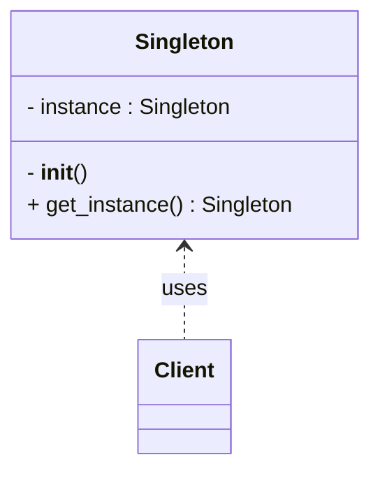

**類型**：Creational Pattern
**別名**：單例模式（Single Instance Pattern）

---

## **💡 1. 定義（Definition）**

> **Singleton Pattern** 確保一個類別在整個應用程式中**只有一個實例（Instance）**，
> 並且提供一個全域訪問點（Global Access Point）來取得該實例。

📘 它解決的問題是：
「如何確保某些資源（例如連線池、設定檔、Logger）在整個系統中只有一份。」

---
## **🎯 2. 問題背景（Problem Statement）**

- 有些物件不應被重複建立，例如：

    - 資料庫連線池        
    - 設定檔讀取器
    - 全域日誌紀錄器
    
- 若多個模組同時初始化自己的實例，會造成：
    
    - 資源衝突或競爭（Resource Contention）
    - 記憶體浪費
    - 資料不一致（不同模組持有不同設定）
  
👉 解法：

確保整個應用中「同一類別永遠只有一份物件」。

## **⚙️ 3. 解決方案（Solution）**

> Singleton 使用 **私有建構子（Private Constructor）** 與 **全域存取方法（Static Method）**，
> 讓外部無法直接建立新實例，只能透過統一入口取得同一個實例。

---

## **🧱 4. 結構與角色（Structure & Participants）**

|**角色**|**職責**|
|---|---|
|**Singleton 類別**|管理自己的唯一實例，提供全域存取方法|
|**Client**|使用 Singleton 的全域實例|



---

## **🧩 5. 程式碼範例（Code Example, Python）**

```python
class Singleton:
    _instance = None

    def __new__(cls):
        if cls._instance is None:
            print("Creating new instance...")
            cls._instance = super().__new__(cls)
        return cls._instance

# 測試
a = Singleton()
b = Singleton()
print(a is b)  # True
```


🧠 說明：

- __new__ 是 Python 負責建立物件的特殊方法。
- 我們在這裡控制它，確保僅建立一次實例。

---

### **✅ 進階版本（執行緒安全）**

```python
from threading import Lock

class ThreadSafeSingleton:
    _instance = None
    _lock = Lock()

    def __new__(cls):
        if cls._instance is None:
            with cls._lock:
                if cls._instance is None:
                    print("Creating new thread-safe instance...")
                    cls._instance = super().__new__(cls)
        return cls._instance

```

💡 雙重檢查鎖（Double-checked Locking）避免多執行緒同時建立多個實例。

---

### **🧠 Pythonic 寫法（使用裝飾器）**

```python
def singleton(cls):
    instances = {}
    def get_instance(*args, **kwargs):
        if cls not in instances:
            instances[cls] = cls(*args, **kwargs)
        return instances[cls]
    return get_instance

@singleton
class Config:
    def __init__(self):
        print("Loading configuration...")

cfg1 = Config()
cfg2 = Config()
print(cfg1 is cfg2)  # True
```


---

## **🧠 6. 實際應用場景（Real-world Use Cases）**

| **場景**     | **實例**                           |
| ---------- | -------------------------------- |
| 🔧 應用設定管理  | 全域 config loader（讀環境變數或設定檔）      |
| 🗃️ 資料庫連線  | 共享同一個 SQLAlchemy Session factory |
| 🧾 Logging | 全域 logger instance               |
| ⚙️ Cache   | Redis client 全域共用                |
| 🌐 SDK     | API client（如 AWS boto3）          |

---

## **⚖️ 7. 優點與缺點（Pros & Cons）**

|**優點**|**缺點**|
|---|---|
|✅ 節省資源，避免重複建立物件|❌ 不易測試，會造成全域依賴|
|✅ 統一管理共享資源|❌ 難以擴展，多執行緒需特別處理|
|✅ 確保狀態一致性|❌ 違反依賴注入原則（Dependency Injection）|

---

## **🔍 8. 與其他模式比較（Comparison）**

| **模式**                       | **差異**                                 |
| ---------------------------- | -------------------------------------- |
| **Factory Pattern**          | Factory 每次都產生新物件；Singleton 永遠只有一個。     |
| **Monostate Pattern**        | Monostate 多個物件共享同一狀態，Singleton 只有單一實例。 |
| **Module Pattern（Pythonic）** | Python 模組天生就是 Singleton（import 只執行一次）。 |

---

## **🧭 9. 實務設計指引（Design Tips）**

- ✅ 適用於資源昂貴、需共用的服務（DB、Config、Cache）
    
- 🚫 不適合在高測試需求的環境（難以 mock / 重置）
    
- 💬 若在微服務中，可用 **DI Container**（例如 FastAPI Depends）取代
    
- 🧰 可結合 **Factory** 或 **Lazy Initialization** 優化效能

---

## **🧮 10. 面試考點（Interview Insights）**

| **常見問法**                | **你應該回答的重點**    |
| ----------------------- | --------------- |
| 什麼是 Singleton？          | 保證只有一個實例存在。     |
| 如何在多執行緒環境實作？            | 使用鎖（Lock）或同步機制。 |
| Python 模組是不是 Singleton？ | 是。模組導入只執行一次。    |
| 缺點是什麼？                  | 難測試、全域依賴、破壞封裝性。 |

---

## **✅ 11. 一句話總結（One-liner Summary）**

> 「Singleton Pattern 讓全系統共享同一個物件，
> 適合用於設定、連線、日誌等需要全域唯一實例的場景。」


## **📚 12. 延伸閱讀（Further Reading）**

- 📘 _Design Patterns: Elements of Reusable Object-Oriented Software_    
- 🧩 Refactoring.Guru – [Singleton Pattern](https://refactoring.guru/design-patterns/singleton)
- 🧱 Source code: [SQLAlchemy Session Singleton Example](https://docs.sqlalchemy.org/en/20/orm/session_basics.html)