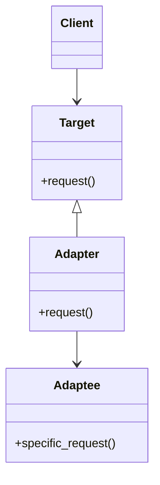

**類型**：Structural Pattern
**別名**：Wrapper（包裝器模式）

## **💡 1. 定義（Definition）**

> **Adapter Pattern** 允許介面不相容的類別可以一起工作。
>   
> 它將一個類別的介面「轉換」成客戶端所期望的另一種介面。

📘 換句話說：

> 「當你想用一個類別，但它的介面跟你系統不對盤時，
> 讓 Adapter 幫你橋接兩邊。」


## **🎯 2. 問題背景（Problem Statement）**

假設你的系統裡使用了某個雲端儲存服務：

假設你的系統裡使用了某個雲端儲存服務：
```python
cloud.upload_file(file_path)
```

但現在公司要改用另一個 SDK，它的方法叫：
```python
storage.put_object(key, data)
```

❌ 問題：

- 客戶端呼叫的介面不一樣。
- 不能直接替換，否則會改壞一堆地方。

✅ 解法：  

> 寫一個 **Adapter**，在內部把新 SDK 的方法「包裝」成舊系統可理解的介面。

---

## **⚙️ 3. 解決方案（Solution）**

> Adapter 將不相容的介面包裝起來，使客戶端可透過統一介面操作不同的實作。
>   
> 它是**結構型橋接**的一種簡單形式。


## **🧱 4. 結構與角色（Structure & Participants）**

|**角色**|**職責**|
|---|---|
|**Target (目標介面)**|客戶端期望的介面|
|**Adaptee (被適配者)**|需要被包裝的現有類別|
|**Adapter (轉接器)**|將 Adaptee 的介面轉換成 Target 可用的介面|
|**Client**|呼叫 Target 介面|



## **🧩 5. 程式碼範例（Python）**

### **🧱 範例 1：舊 vs 新雲端 SDK**

```python
# === 舊系統期望的介面 ===
class CloudStorage:
    def upload_file(self, file_path):
        raise NotImplementedError


# === 新 SDK (不相容介面) ===
class NewStorageSDK:
    def put_object(self, key, data):
        print(f"✅ Uploading {key} with new SDK")


# === Adapter ===
class StorageAdapter(CloudStorage):
    def __init__(self, new_sdk: NewStorageSDK):
        self.new_sdk = new_sdk

    def upload_file(self, file_path):
        # 模擬讀取檔案內容
        data = f"binary data of {file_path}"
        self.new_sdk.put_object(file_path, data)


# === Client Code ===
def client_code(storage: CloudStorage):
    storage.upload_file("report.pdf")

# 使用新 SDK，但透過 Adapter 保持相同介面
adapter = StorageAdapter(NewStorageSDK())
client_code(adapter)
```

輸出：
```
✅ Uploading report.pdf with new SDK
```

💡 客戶端不需要知道 SDK 換了，
Adapter 幫忙把介面「翻譯」好。

### **🧩 範例 2：第三方 API 整合**

你原本的系統呼叫：
```python
payment.process(amount)
```

但新 API 長這樣：
```python
gateway.make_payment(value)
```

Adapter：
```python
class PaymentAdapter:
    def __init__(self, gateway):
        self.gateway = gateway

    def process(self, amount):
        self.gateway.make_payment(value=amount)
```

## **🧠 6. 實際應用場景（Real-world Use Cases）**

| **場景**        | **實例**                             |
| ------------- | ---------------------------------- |
| ☁️ 第三方 API 整合 | Stripe / PayPal / AWS SDK          |
| 🧱 舊系統遷移      | 新版模組包裝舊版介面                         |
| 🧩 資料格式轉換     | JSON → XML, Dict → Object          |
| 🧠 AI 模型接入    | 統一不同推理框架的介面（例如 OpenAI / Anthropic） |
| 🎮 遊戲開發       | 適配不同輸入設備（手把 / 觸控）                  |

## **⚖️ 7. 優點與缺點（Pros & Cons）**

|**優點**|**缺點**|
|---|---|
|✅ 讓不相容的介面能共存|❌ 增加一層間接性（debug 變麻煩）|
|✅ 可逐步重構舊系統|❌ 可能變成「Adapter 地獄」|
|✅ 減少改動風險|❌ 不適合完全重寫架構的情境|

## **🔍 8. 與其他模式比較（Comparison）**

|**模式**|**差異**|
|---|---|
|**Bridge**|抽象與實作分離，用於擴展不同維度|
|**Decorator**|增強功能，但不改變介面|
|**Adapter**|改變介面以兼容不同系統|
|**Facade**|提供簡化介面，非轉換介面|

## **🧭 9. 實務設計指引（Design Tips）**

- ✅ 適合「漸進式重構」舊系統
- ✅ 使用於「第三方 SDK / API」整合層
- 🚫 不要在新專案一開始就用，應用於整合階段
- 💬 讓 Adapter 盡量**無邏輯、輕量化**，只負責轉換介面，不要混入商業邏輯

## **🧮 10. 面試考點（Interview Insights）**

| **問題**           | **回答重點**                   |
| ---------------- | -------------------------- |
| Adapter 解決什麼問題？  | 讓介面不相容的類別能一起運作。            |
| 實際例子？            | 整合新舊 SDK、API Gateway、格式轉換。 |
| 與 Decorator 不同點？ | Decorator 加功能，Adapter 改介面。 |
| Python 怎麼實現？     | 用組合（composition）封裝被適配對象。   |

## **✅ 11. 一句話總結（One-liner Summary）**

> 「Adapter Pattern 是讓老系統與新系統和平共處的外交官，
> 它不改變對方，只翻譯介面讓雙方能對話。」


## **📚 12. 延伸閱讀（Further Reading）**

- 📘 _Design Patterns: Elements of Reusable Object-Oriented Software_
- 🧩 Refactoring.Guru – [Adapter Pattern](https://refactoring.guru/design-patterns/adapter)
- 🧱 Example: Python logging.Handler wrappers, SDK compatibility layers
