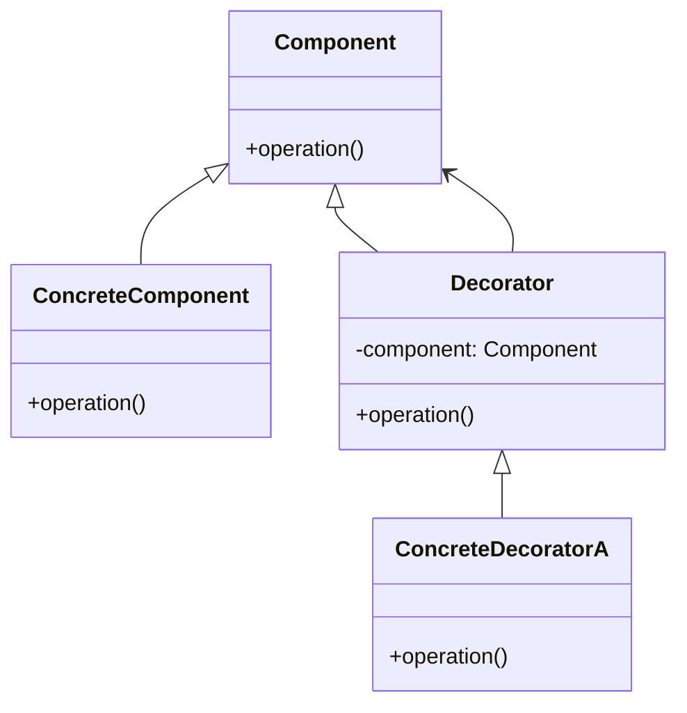

**類型**：Structural Pattern
**別名**：Wrapper Pattern（裝飾器模式）

---
## **💡 1. 定義（Definition）**

> **Decorator Pattern** 動態地給物件添加新功能，
> 而不改變原本類別的結構或介面。

📘 一句話：

> 「不改原始程式碼，但可以在外層包一層新行為。」

## **🎯 2. 問題背景（Problem Statement）**

你想替某個功能增加以下特性：

- 記錄 log
- 加 cache
- 加 retry
- 加 rate limit
- 加 permission check

但不能修改原始類別（如第三方 SDK、legacy code）。

如果你硬改：

- 🔥 會破壞封裝性    
- 🔥 很難維護
- 🔥 改壞一次全部掛掉

👉 解法：外層用一個 wrapper（Decorator）把新功能包起來。

---
## **⚙️ 3. 解決方案（Solution）**

> 使用 Decorator 將物件包起來，
> 使其「表面看起來一樣」，
> 但行為上比原物件多了額外功能。

---

## **🧱 4. 結構與角色（Structure & Participants）**

| **角色**                  | **職責**              |
| ----------------------- | ------------------- |
| **Component**           | 原始介面                |
| **Concrete Component**  | 原始實作                |
| **Decorator**           | 實作相同介面，包裝 component |
| **Concrete Decorators** | 真正新增行為的地方           |



## **🧩 5. 程式碼範例（Python）**

### **🧱 範例：加 Log + 加 Cache 的 API Wrapper**

```python
from functools import lru_cache

# === Component ===
class WeatherAPI:
    def get_weather(self, city):
        print("🌧️ Fetching weather from real API...")
        return f"Weather info for {city}"


# === Decorator 基底 ===
class WeatherAPIDecorator:
    def __init__(self, api: WeatherAPI):
        self.api = api

    def get_weather(self, city):
        return self.api.get_weather(city)


# === Concrete Decorators ===
class LoggingDecorator(WeatherAPIDecorator):
    def get_weather(self, city):
        print(f"📘 Log: Calling get_weather({city})")
        return self.api.get_weather(city)


class CacheDecorator(WeatherAPIDecorator):
    @lru_cache(maxsize=128)
    def get_weather(self, city):
        print("📦 Cache miss → calling API")
        return self.api.get_weather(city)


# === 使用 ===
api = WeatherAPI()
api = LoggingDecorator(api)
api = CacheDecorator(api)

print(api.get_weather("Taipei"))
print(api.get_weather("Taipei"))
```

輸出：

```
📘 Log: Calling get_weather(Taipei)
📦 Cache miss → calling API
🌧️ Fetching weather from real API...

📘 Log: Calling get_weather(Taipei)
(來自 cache，不會再呼叫 API)
```

🧠 重點：

你不需改原本的 WeatherAPI，
就能添加 log + cache + retry 等功能。

### Pythonic 寫法

```python
import functools
from functools import lru_cache

# === LOG DECORATOR ===
def log(func):
    @functools.wraps(func)
    def wrapper(*args, **kwargs):
        print(f"📘 Log: Calling {func.__name__} with args={args}, kwargs={kwargs}")
        return func(*args, **kwargs)
    return wrapper


# === CACHE DECORATOR ===
def cache(func):
    # 使用 Python 內建 lru_cache 做快取
    cached = lru_cache(maxsize=128)(func)

    @functools.wraps(func)
    def wrapper(*args, **kwargs):
        return cached(*args, **kwargs)   # cache 會自動判斷是否命中
    return wrapper


# === Weather API 函式（會被裝飾）===
@cache      # cache 在最內層（最靠近 function）
@log        # log 在外層（每次都會打印）
def get_weather(city: str):
    print("🌧️ Fetching weather from REAL API...")
    return f"Weather info for {city}"


# === 測試 ===
print(get_weather("Taipei"))    # 第一次 → 真實 API + log + cache miss
print(get_weather("Taipei"))    # 第二次 → 仍有 log，但不會呼叫 API（cache hit）

print(get_weather("Tokyo"))     # 新城市 → 須再次呼叫 API
print(get_weather("Tokyo"))     # cache hit
```

輸出結果：
```
📘 Log: Calling get_weather with args=('Taipei',), kwargs={}
🌧️ Fetching weather from REAL API...
Weather info for Taipei

📘 Log: Calling get_weather with args=('Taipei',), kwargs={}
Weather info for Taipei   # ← 這次沒有呼叫 API（cache hit）

📘 Log: Calling get_weather with args=('Tokyo',), kwargs={}
🌧️ Fetching weather from REAL API...
Weather info for Tokyo

📘 Log: Calling get_weather with args=('Tokyo',), kwargs={}
Weather info for Tokyo    # cache hit
```

# **🧠** **理解重點**

## **1. 裝飾器串接的順序很重要**
```python
@cache
@log
def get_weather():
```

等同於
```python
get_weather = cache(log(get_weather))
```

也就是：
1️⃣ log 會先包住原本的函式
2️⃣ cache 再包住 log 的 wrapper

## **2. log decorator** 每次都會印 log

因為 log decorator 的 wrapper 在 cache 外層。
如果你希望 cache hit 時不 log，
調換順序即可：

```python
@log
@cache
def get_weather():
```

## **3. Python 的 @decorator 本質上就是設計模式的 Decorator Pattern**

|**設計模式角色**|**Python 對應**|
|---|---|
|Component|原始函式|
|Decorator|@decorator wrapper|
|ConcreteDecorator|log, cache|
|多層封裝|多層 @decorator|

參考資料：
https://youtu.be/r7Dtus7N4pI?si=H6fJxv7sqLFoiqgx
https://www.youtube.com/watch?v=JgxCY-tbWHA

---

## **🧠 6. 實際應用場景（Real-world Use Cases）**

| **場景**                      | **實例**                                        |
| --------------------------- | --------------------------------------------- |
| 🧾 **Logging / Monitoring** | API wrapper、ORM logging                       |
| ⚡ **Caching**               | Redis decorator, lru_cache                    |
| 🔁 **Retry / Backoff**      | requests + retry decorator                    |
| 🛡️ **Auth / Permission**   | FastAPI / Flask 的 @requires_auth              |
| 🚦 **Rate Limit**           | API decorator: @limiter.limit("10/min")       |
| 🔌 **Middleware**           | FastAPI / Django middleware 100% 就是 Decorator |

## **⚖️ 7. 優點與缺點（Pros & Cons）**

|**優點**|**缺點**|
|---|---|
|✅ 不改原本類別即可增加功能|❌ 過多 Decorator 會造成調試困難|
|✅ 支援動態組合（log + cache + retry）|❌ 執行流程變多層，call chain 很長|
|✅ 避免 subclass 爆炸|❌ 新手難以理解多層 wrapper|

## **🔍 8. 與其他模式比較（Comparison）**

|**模式**|**差異**|
|---|---|
|**Adapter**|改變介面 → 讓兩者相容|
|**Decorator**|保持介面 → 新增功能|
|**Proxy**|控制訪問、安全、緩存（本質上是特化版 Decorator）|
|**Facade**|提供簡化介面，不是逐層包裝|

## **🧭 9. 實務設計指引（Design Tips）**

- ✅ 使用在「橫切關注點（cross-cutting concerns）」
	如 logging / caching / auth / monitoring
    
- ✅ 確保 decorator 不做太多事（SRP 單一職責原則）
- 🚫 不要在 decorator 混入業務邏輯
- 💬 建議與 FastAPI Depends、DI Container 搭配更乾淨

## **🧮 10. 面試考點（Interview Insights）**

|**常見問題**|**回答重點**|
|---|---|
|Decorator 用來做什麼？|不改原類別就能動態加入功能。|
|和 Adapter 有什麼不同？|Adapter 改介面，Decorator 加行為。|
|在後端實際例子？|Middleware、cache wrapper、retry decorator。|
|Python 如何實現？|@decorator 或 class wrapper。|

## **✅ 11. 一句話總結（One-liner Summary）**

> 「Decorator Pattern 就像 ‘功能貼紙’，
> 想貼幾層都可以，不用動到原本的物件。」

---

## **📚 12. 延伸閱讀（Further Reading）**

- 📘 _Design Patterns: Elements of Reusable Object-Oriented Software_
- 🧩 Refactoring.Guru – [Decorator Pattern](https://refactoring.guru/design-patterns/decorator)
- 🧱 Python functools.wraps, lru_cache, FastAPI middleware

