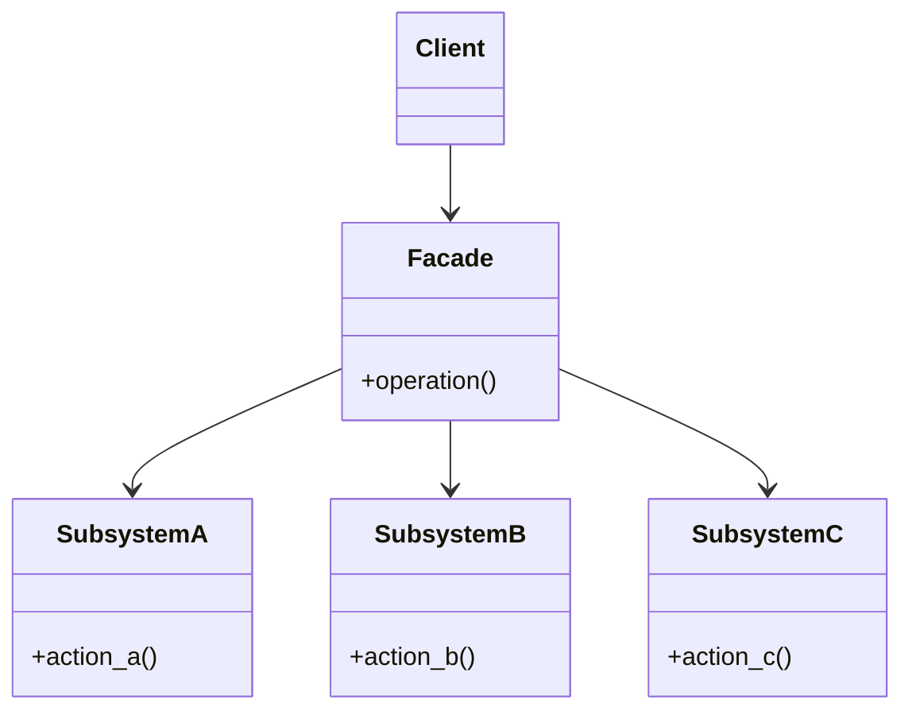

**類型**：Structural Pattern
**別名**：門面模式（Wrapper of Subsystems）

---
## **💡 1. 定義（Definition）**

> **Facade Pattern** 提供一個**統一的高層介面（Unified Interface）**，
> 讓客戶端可以更容易地使用一組複雜的子系統。

📘 簡單說：

> 「把底層很多雜亂的系統，包成一個乾淨好用的介面。」

---
## **🎯 2. 問題背景（Problem Statement）**

假設你要在程式裡發送一封 Email，
但實際上後端要做這些事：

1. 連線 SMTP 伺服器
2. 檢查寄件者認證
3. 格式化郵件內容
4. 記錄寄信日誌
5. 更新發送統計

每次寄信都要重複這些步驟，
而且如果哪個模組換實作，所有地方都要改。

✅ 解法：

> 建立一個 **EmailService（Facade）**，
> 把這些流程統一封裝起來，讓使用者只要呼叫：

```python
email_service.send("to@example.com", "Hello!")
```

## **⚙️ 3. 解決方案（Solution）**

> Facade Pattern 在複雜子系統上提供一個簡化的高層介面，
> 客戶端只需與這個介面互動，不必理解底層細節。

---
## **🧱 4. 結構與角色（Structure & Participants）**

|**角色**|**職責**|
|---|---|
|**Facade**|封裝多個子系統，提供統一入口|
|**Subsystem Classes**|實際執行的複雜功能|
|**Client**|只與 Facade 溝通，不直接接觸子系統|




## **🧩 5. 程式碼範例（Python）**

### **🧱 範例：寄信系統**
```python
# === Subsystems ===
class SMTPServer:
    def connect(self): print("📡 Connecting to SMTP server...")
    def send(self, message): print(f"📨 Sending email: {message}")

class Logger:
    def log(self, msg): print(f"🪵 Log: {msg}")

class StatsTracker:
    def update(self, event): print(f"📊 Updating stats for {event}")


# === Facade ===
class EmailService:
    def __init__(self):
        self.smtp = SMTPServer()
        self.logger = Logger()
        self.tracker = StatsTracker()

    def send_email(self, recipient, content):
        self.smtp.connect()
        self.smtp.send(f"To: {recipient}, Body: {content}")
        self.logger.log(f"Email sent to {recipient}")
        self.tracker.update("email_sent")
        print("✅ Email successfully sent!\n")


# === Client ===
service = EmailService()
service.send_email("user@example.com", "Hello, world!")
```

輸出：
```
📡 Connecting to SMTP server...
📨 Sending email: To: user@example.com, Body: Hello, world!
🪵 Log: Email sent to user@example.com
📊 Updating stats for email_sent
✅ Email successfully sent!
```

🧠 說明：

- Client 不需知道 SMTP / Logger / Tracker 細節
- Facade 幫忙整合多個模組 → 統一入口

## **🧠 6. 實際應用場景（Real-world Use Cases）**

|**場景**|**實例**|
|---|---|
|☁️ **API Gateway**|封裝多個微服務成單一 REST 入口|
|💳 **支付流程**|封裝金流、訂單、通知模組|
|📦 **SDK / Library 封裝**|提供簡潔介面給開發者使用（例如 boto3、stripe-python）|
|🧱 **系統整合層**|封裝 legacy system 的呼叫邏輯|
|🧠 **AI pipeline**|封裝 tokenizer、model、embedding 流程成單一 inference()|

## **⚖️ 7. 優點與缺點（Pros & Cons）**

|**優點**|**缺點**|
|---|---|
|✅ 降低子系統耦合度|❌ 可能成為「上帝類別」（God Object）|
|✅ 對外提供簡化介面|❌ 若封裝過多，靈活性下降|
|✅ 易於維護與重構|❌ 不易測試單一子模組|

## **🔍 8. 與其他模式比較（Comparison）**

|**模式**|**差異**|
|---|---|
|**Adapter**|改變介面以相容；Facade 提供統一入口|
|**Proxy**|控制訪問；Facade 簡化使用|
|**Mediator**|負責物件間互動邏輯；Facade 是系統對外門面|
|**Decorator**|加功能不改介面；Facade 包裝多模組|

## **🧭 9. 實務設計指引（Design Tips）**

- ✅ 用於**整合層**或**對外 API**    
- ✅ 適合**微服務封裝 SDK / Gateway**
- 🚫 不建議封裝太多層，應保持「高層抽象 + 底層可擴展」
- 💬 通常與 **Adapter Pattern** 並用：
    - Facade 封裝多個系統
    - Adapter 統一它們的介面


## **🧮 10. 面試考點（Interview Insights）**

|**問題**|**關鍵回答**|
|---|---|
|Facade Pattern 解決什麼問題？|將複雜子系統封裝成統一介面。|
|與 Adapter 的差異？|Adapter 解決介面不相容，Facade 解決使用太複雜。|
|實際例子？|API Gateway、SDK Wrapper、Logging Utility。|

## **✅ 11. 一句話總結（One-liner Summary）**

> 「Facade Pattern 就像 API Gateway，
> 讓一堆雜亂的系統對外看起來只有一個乾淨入口。」


## **📚 12. 延伸閱讀（Further Reading）**

- 📘 _Design Patterns: Elements of Reusable Object-Oriented Software_
- 🧩 Refactoring.Guru – [Facade Pattern](https://refactoring.guru/design-patterns/facade)
- 🧱 Example: AWS boto3 client, Stripe SDK, API Gateway Pattern